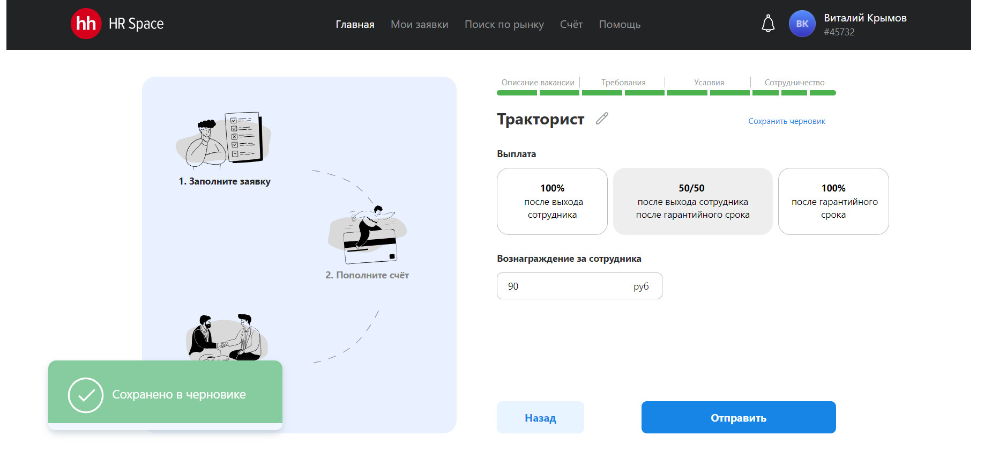

# Frontend для HR Space приложения

## Описание проекта

Дать заказчикам возможность размещать заявку на подбор по трем моделям
оплаты. Рекрутерам – откликаться и вести переписку с клиентами в рамках
внутреннего чата, направлять резюме и регистрировать вышедшего сотрудника
(дата выхода и прохождение испытательного срока).

## Используемые технологии

- TS [TypeScript](https://www.typescriptlang.org/)
- ⚛️[React](https://ru.reactjs.org/)

## Сведения о команде:

1. Сидорчук Николай - Профиль на GitHub [https://github.com/k0t1k777](https://github.com/k0t1k777) 
2. Ким Се-Ун - Профиль на GitHub [https://github.com/Se-Un](https://github.com/Se-Un)

## ссылка на Github Pages
[Ссылка: https://k0t1k777.github.io/HR_Space](https://k0t1k777.github.io/HR_Space)

## Инструкции по установке и запуску

1. Клонируйте репозиторий: `git clone git@github.com:k0t1k777/HR_Space.git`
2. Перейдите в директорию проекта: `cd HR_Space`
3. Установите зависимости: `npm install`
4. Запустите проект: `npm run dev`
5. В браузере открываем `http://localhost:5173/`

Или

1. Переходим по этой ссылке: `https://github.com/k0t1k777/HR_Space/tree/dev`
2. Нажимаем `Code`
3. Нажимаем `Download ZIP`
4. Распаковываем скачанный архив в любое удобное место
5. Заходим в `Visual Studio Code`, в разделе `Файл` выбираем `Открыть папку`, выбираем распакованную папку, жмём `Ok`
6 .В разделе `Терминал` выбираем `Создать терминал`
7. Пишем в терминале: `cd HR_Space`
8. Установка зависимости: `npm install`
9. Запуск проект: `npm run dev`
10. В браузере открываем `http://localhost:5173/`

## Библиотеки,которые использовалис

1. mui/x-date-pickers-pro
4. @hookform/resolvers
5. yup

## Ключевые точки для медиа min,max-width: 1440px

